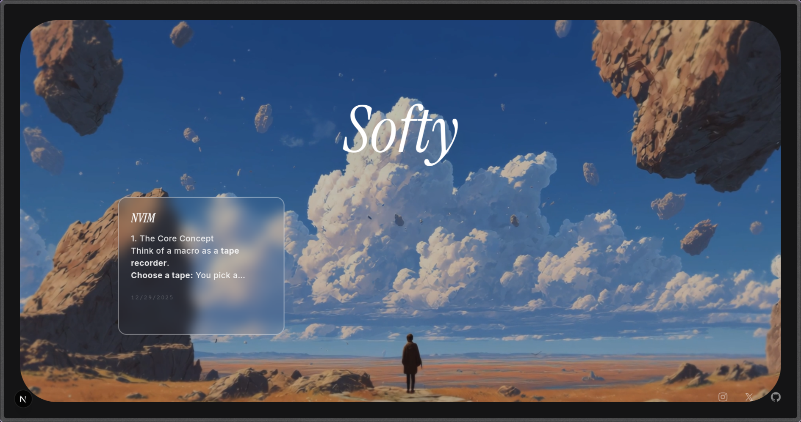

# Softy

A modern, visually stunning web application for sharing and exploring topics, fun facts, and articles. Built with Next.js, it features a glassmorphic design, rich text support with Markdown & LaTeX, and a secure admin dashboard.



## Features

- **Immersive Design:** Full-screen video backgrounds with a sophisticated glassmorphism UI.
- **Rich Content:** Support for **Markdown** styling and **LaTeX** mathematical equations (via KaTeX).
- **Interactive Topics:** Responsive grid layout with transparent cards and detailed modal popups.
- **Admin Dashboard:** Secure, password-protected interface to create and manage content.
- **Responsive:** Fully optimized for mobile, tablet, and desktop devices.
- **Modern Tech Stack:** Built on the latest Next.js 15 app router.

## Tech Stack

- **Framework:** [Next.js 15](https://nextjs.org/) (React 19)
- **Styling:** [Tailwind CSS](https://tailwindcss.com/)
- **UI Components:** [Shadcn/ui](https://ui.shadcn.com/)
- **Database:** [MongoDB](https://www.mongodb.com/)
- **Math Rendering:** [KaTeX](https://katex.org/)
- **Animations:** [Framer Motion](https://www.framer.com/motion/)

## Getting Started

### Prerequisites

- Node.js (v18+)
- MongoDB Atlas Account (or local MongoDB)

### Installation

1.  **Clone the repository:**

    ```bash
    git clone https://github.com/yourusername/synecdoche.git
    cd synecdoche
    ```

2.  **Install dependencies:**

    ```bash
    npm install
    # or
    pnpm install
    # or
    bun install
    ```

3.  **Configure Environment:**
    Copy the example environment file and update it with your credentials.

    ```bash
    cp .env.example .env.local
    ```

    Open `.env.local` and set your variables:
    - `MONGODB_URI`: Your MongoDB connection string.
    - `ADMIN_PASSWORD_HASH`: Your plain-text admin password.
    - `NEXT_PUBLIC_ADMIN_EMAIL`: Your admin email.

4.  **Run the development server:**

    ```bash
    npm run dev
    ```

    Open [http://localhost:3000](http://localhost:3000) with your browser to see the result.

## Usage

### Admin Access

1.  Navigate to `/admin`.
2.  Log in with your email and password (configured in `.env.local`).
3.  Use the form to upload new topics. You can write content using standard Markdown and LaTeX syntax (e.g., `$$E=mc^2$$`).

### Public View

1.  Visit the homepage `/`.
2.  Browse the grid of topics.
3.  Click any card to open a glassmorphic popup with the full article.

## License

Distributed under the MIT License. See `LICENSE` for more information.
